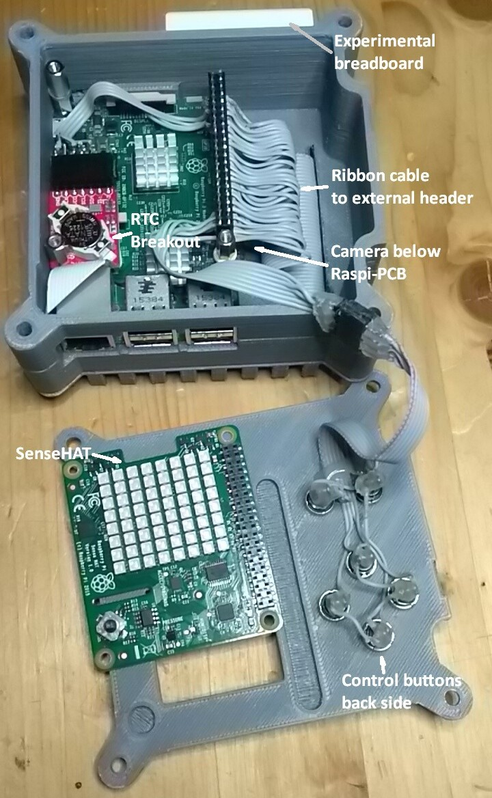

# AstroPi #

My version of a RaspberryPi AstroPi Clone

On the Raspberry Pi homepage I found a few years ago a blog entry about the [AstroPi](https://www.raspberrypi.org/blog/astro-pi-tech-specs/) and later-on more on a [dedicated website](https://astro-pi.org/). As I was in the non-profit space business for some time, I got curious and decided to get started.

Here I'll describe the several steps that led me to the final AstroPi...

## Case ##

The case is one of the four core elements to make an AstroPi clone from a RaspberryPi. I took the 3D data being referenced on

- [The Blog](https://www.raspberrypi.org/blog/astro-pi-3d-print-your-own-flight-case/)
- [The Projekt](https://projects.raspberrypi.org/en/projects/astro-pi-flight-case)

and sent them to one of the many online 3D printing hubs [(e. g. MakeXYZ)](https://www.makexyz.com/) to get the case printed. For a few EUROs I got a suitable case. Unfortunately my print shop isn't available anymore.

## SenseHAT ##

The SenseHAT is another core element. It has a Colour-LED matrix, sensors for acceleration, temperature, humidiy and air pressure as well as a joystick on board abd acts as an user interface on board the ISS.

- [SenseHAT Hardware](https://www.raspberrypi.org/products/sense-hat/)
- [SenseHAT Getting Started](https://projects.raspberrypi.org/en/projects/getting-started-with-the-sense-hat)

The SenseHAT fits onto the 40-pin header of the Pi. I got mine here:

- [My Source](https://www.reichelt.de/raspberry-pi-shield-sense-hat-rpi-sense-hat-p159365.html?r=1)

## Camera ##

To get almost full compatibility to the AstroPi's hardware, I added as the next core component an original RaspiCam I still had in stock. It is the old 5 MP one, sold in the early RaspberrPi days. On the ISS are two AstroPi (named Ed and Izzy), one with a camera for visible light and one for infrared light. Make your choice depending on the tasks of your AstroPi.

- [Camera](https://www.raspberrypi.org/products/camera-module-v2/)
- [IR Camera](https://www.raspberrypi.org/products/pi-noir-camera-v2/)
- [Camera Getting Started](https://projects.raspberrypi.org/en/projects/getting-started-with-picamera)
- [My Source](https://www.reichelt.de/raspberry-pi-kamera-8mp-v2-1-imx219pq-rasp-cam-2-p170853.html?&trstct=pol_5)

## Real Time Clock ##

On-board the ISS the RaspberryPi has no access to the internet. But the usual Pi gets its real time from a time server somewhere on the web. To get a real time after power-down, the AstroPis are equipped with an additional hardware-based real time clock (RTC) as core element no. 4. I guessed it could be one of the 8523-types.

I got mine here:

- [RTC Breakout](https://shop.watterott.com/RV-8523-RTC-Ultra-Low-Power-Real-Time-Clock-Module)

But other types are available (e.g.):

- [from Adafruit](https://www.adafruit.com/product/3013)
- [Tutorial](https://learn.adafruit.com/adding-a-real-time-clock-to-raspberry-pi/overview) - helped me with additional info for setup

## Enhanced Connectivity ##

The major change to the AstroPis flying on the ISS is the full access to the 40-pin header of the RaspberryPi. As I use my AstroPi as an experimental and demonstration platform, I glued a 40-pin header on the outside of the case (see images below) and soldered a ribbon cable to the sockets sitting between Pi and SenseHAT.

## Assembly ##

For stands, spacers, sockets I took parts I already had in stock. It may be difficult to find a socket long enough to connect PI and SenseHAT. I took to with extended pins and cut one of them to fit into the case. Fiddeling all together was the really time consuming part of the building process

**NOTICE!** Don't use a metal stand near the WiFi/Bluetooth antenna. Avoid it (as I deed) or use a plastic one.

As I didn't have much time for a proper assembly after business hours and family needs, it became - as usually - a rather quick and dirty hack. See the following pictures...

### The completed AstroPi ###

View into the case with camera assembled below the RaspberryPi pcb (mine is a RaspberryPi 3 Model B), Pi and the RTC breakout mounted on one stand.

The finished AstroPi (front and top with breadboard)

The finished AstroPi (back with camera holes and external 40-pin header)

## Software ##

## Licensing ##

Please respect all licenses.

The initial information is provided for free by the [Raspberry Pi Foundation](https://www.raspberrypi.org/) under a [Creative Commons](https://www.raspberrypi.org/creative-commons/) licence.

All my additions to the project or own creations for the project are for use under the  **Beer-Ware License** (Revision 42.fs): "*dl6dbn@googlemail.com* made this stuff. As long as you retain this notice you can do whatever you want with this stuff. If we meet some day, and you think this stuff is worth it, you can buy me a beer (or another drink I like) in return." *Frank Sperber (DL6DBN)* with thanks to [PHK](https://people.freebsd.org/~phk/) for writing down this beautiful kind of license.

*as of: November 2019*
